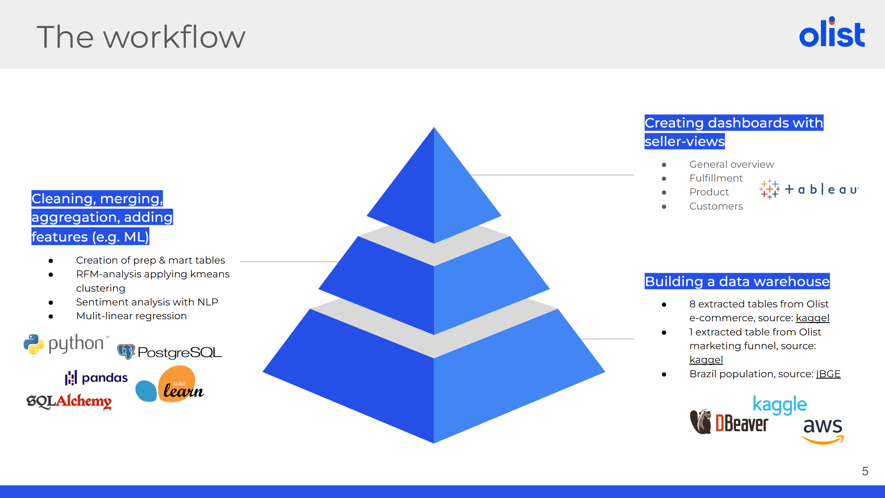
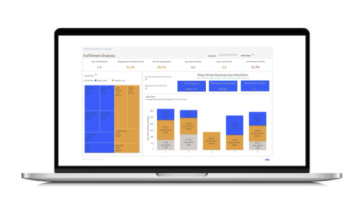

# Fulfillment Analysis

This repository presents my individual contributions to a larger **Data Analytics Capstone Project** based on the **Olist Brazilian E-Commerce dataset**.

---

## 📌 Project Overview

**Project Goal:**  
Enhance Olist's product portfolio with a **holistic premium dashboard** that enables sellers to track their business performance across multiple areas: **Olist Smart Insights**.
  

**Workflow:**  

---

## 🎯 My Contributions

| Area           | Scope                                                                                       |
|----------------|--------------------------------------------------------------------------------------------|
| Data Pipeline  | Data cleaning, merging, consolidation, and clustering of business segments and product categories using K-Means (LLama), plus creation of prep & mart tables |
| Analytics      | Fulfillment analysis and development of a revenue-risk prediction model                     |
| Visualization  | Interactive Tableau dashboard showcasing key insights                                        |
| Presentation   | Delivering the final project presentation to stakeholders                                   |

---

## 🎯 Fulfillment Analysis

I conducted a **fulfillment analysis** for sellers on the **Olist E-Commerce platform (Brazil)**, aiming to help sellers:  
- Identify delivery bottlenecks  
- Benchmark performance against peers in the same business segment  
- Predict revenue at risk due to delivery delays and low reviews  

### Key Contributions

1. **Defining KPIs and Benchmarking**  
   - Selected key metrics to measure seller fulfillment performance  
   - Implemented a **traffic-light alert system**:  
     - **Green** – performance 10% above average  
     - **Yellow** – close to average  
     - **Red** – more than 10% below average  
   - Colored indicators allow sellers to **quickly identify bottlenecks** in their delivery processes  

2. **Geographic Insights**  
   - Analyzed cities with the **longest average delivery delays**  
   - Visualized **top N delayed cities by revenue** using a treemap  
   - Provided **product-level insights per city**, helping sellers optimize inventory and delivery strategies for specific SKUs  

3. **Delivery and Customer Reviews Analysis**  
   - Correlated delivery delays with customer reviews  
   - Created **bar charts** showing:  
     - Revenue and number of orders for delayed/on-time orders per review category  
     - Average Order Value (AOV) per order and per product category per review category  
   - Enables sellers to identify **high-value low-review orders** and affected product categories  

4. **Revenue-at-Risk Prediction**  
   - Built a **linear regression model** to estimate revenue potentially lost due to delayed and low-review orders  
   - Alerts highlight significant revenue losses in **red**, allowing proactive measures  

### Outcome

This analysis provides sellers with **actionable insights** into:  
- Delivery performance  
- Revenue risks  
- Potential improvement areas  

Helping sellers **optimize fulfillment and enhance customer satisfaction**.

---

## 📈 Fulfillment Analysis Dashboard

Interactive dashboard available on **Tableau Public**:  
[Olist E-Commerce Seller Fulfillment Dashboard](https://public.tableau.com/app/profile/jing.wang8227/viz/Olist_E-Commerce_Seller_Fullfillment_Dashboard/FulfillmentPerformanceDashboard)

---

## 🛠️ Tools & Technologies

- **Python:** Pandas, SentenceTransformer, Scikit-Learn, etc.  
- **SQL:** PostgreSQL  
- **Tableau**  
- **Jupyter Notebooks**  
- **GitHub**  
- **Google Slides**

---

## 🗂️ Data Sources

- Olist E-Commerce Dataset ([Kaggle](https://www.kaggle.com/datasets/olistbr/brazilian-ecommerce))  
- Olist Marketing Funnel Dataset ([Kaggle](https://www.kaggle.com/datasets/olistbr/marketing-funnel-olist))  
- Brazilian Population Data ([IBGE](https://www.ibge.gov.br/))
